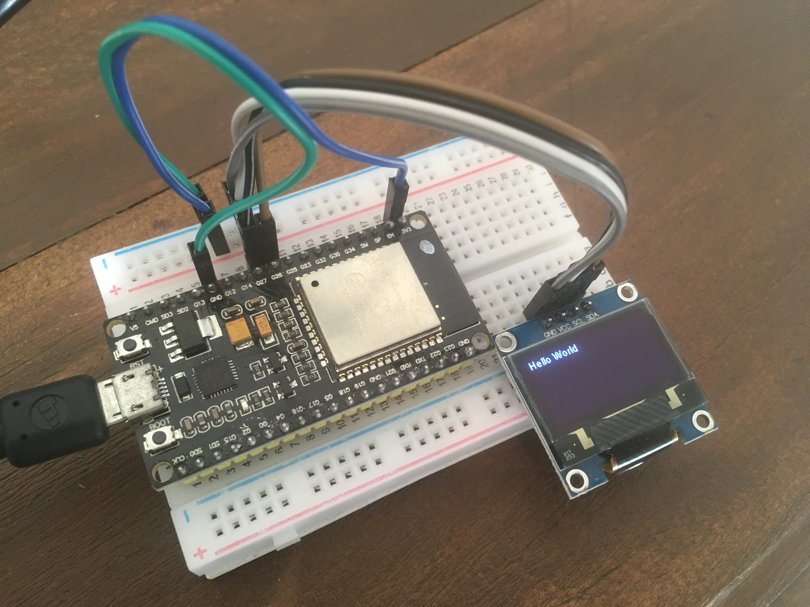
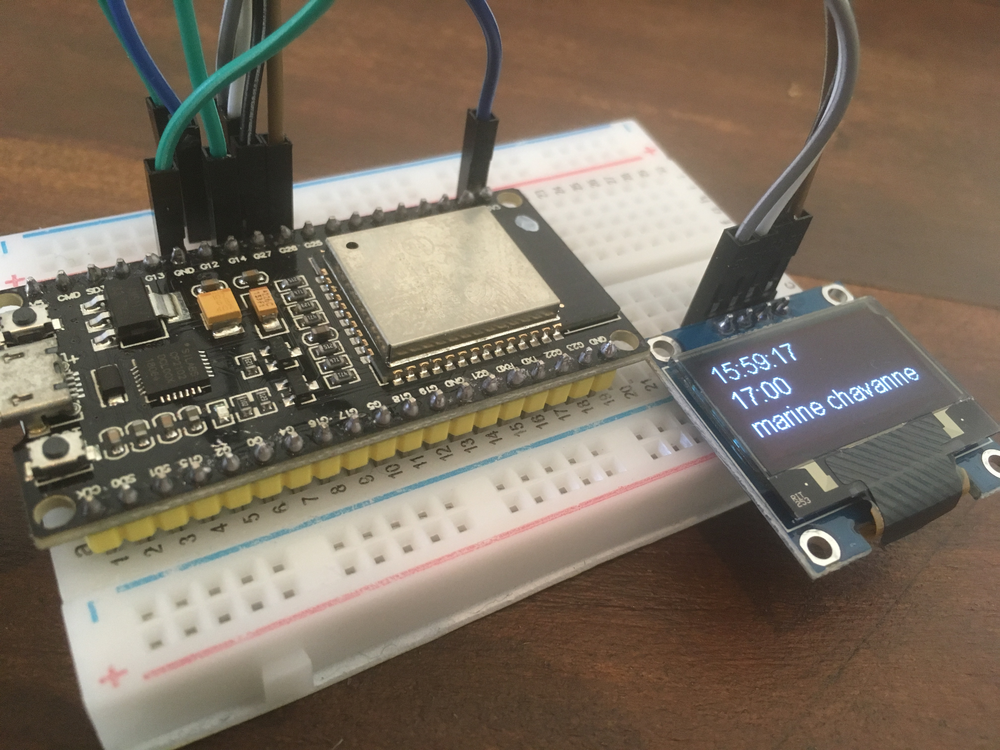

# meeting_gadget

Multi-purpose meeting room gadget

## Ideas

- Show time of next meeting
- Alert 5 minutes before end of meeting
- Motion sensor to detect if meeting room is in use?

## Todo

- [x] Get ESP32 built-in LED blinking
- [x] Write to OLED SSD1306 display
- [x] Get ESP32 connecting to wifi
- [x] Build simple JSON web service
- [x] Get ESP32 to poll web service and show data on screen
- [x] Build simple web service to get meeting data (maybe using Google Script?)

## Resources

- ESP32 Arduino: Interacting with a SSD1306 OLED display https://techtutorialsx.com/2017/12/02/esp32-arduino-interacting-with-a-ssd1306-oled-display/
- Getting Arduino response headers https://techtutorialsx.com/2018/06/08/esp8266-arduino-getting-http-response-headers/

## Notes

- Needed to install [USB to UART drivers](https://www.silabs.com/products/development-tools/software/usb-to-uart-bridge-vcp-drivers) to get the device to show up in OSX.
- Installed ESP32 Arduino core https://github.com/espressif/arduino-esp32
- Installed ESP32 Arduino SSD1306 OLED driver https://github.com/ThingPulse/esp8266-oled-ssd1306

## Progress

Hello World on OLED display

Meeting data

